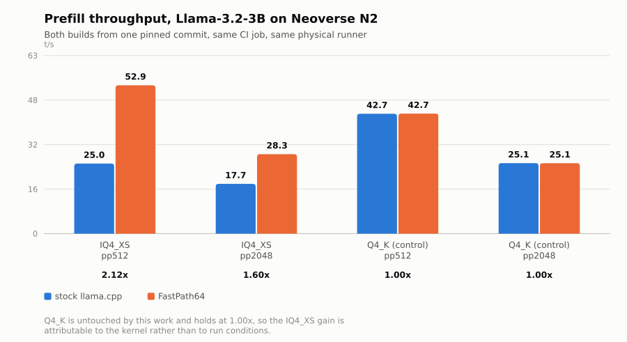
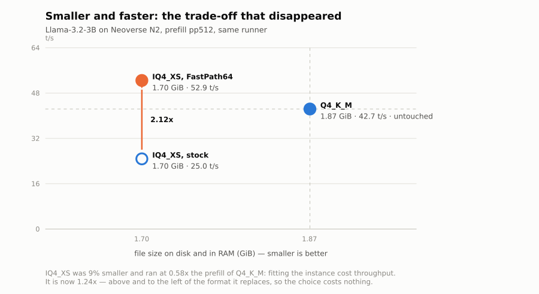
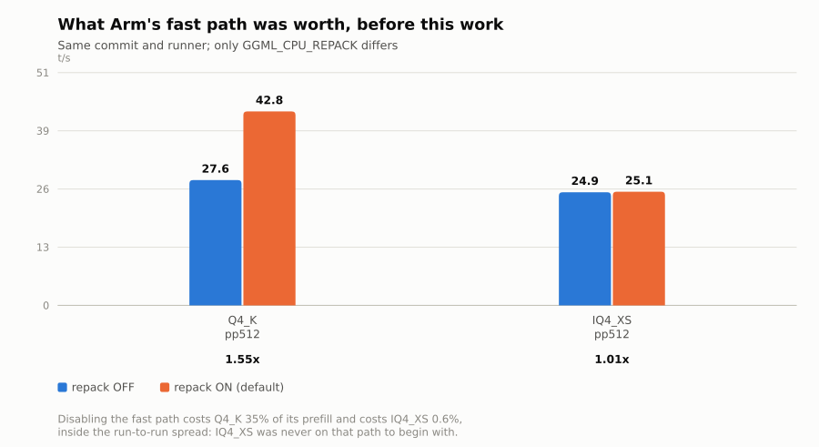

# FastPath64

**IQ4_XS is the smallest 4-bit format in the standard GGUF release ladder. It had an accelerated
matmul kernel on Intel AMX and none on Arm.**

That was not a claim about benchmarks. It is what upstream `llama.cpp` says about itself:

```
$ grep -c IQ4_XS ggml/src/ggml-cpu/repack.cpp          # Arm's row-interleaved smmla kernels
0
$ grep -n IQ4_XS ggml/src/ggml-cpu/amx/common.h        # Intel AMX tiled kernels
114:        (type == GGML_TYPE_IQ4_XS);
```

So a Qwen3.6-35B-A3B or gemma-4-26B-A4B in IQ4_XS, served on a Graviton / Cobalt / Axion instance,
ran its expert matmuls with **zero I8MM acceleration** — locked out of the repack path (type not in
the table) *and* out of KleidiAI (which supports neither `MUL_MAT_ID` nor IQ types). The `smmla`
unit sat idle while the core did scalar-ish dot products.

There is a loop worth naming: on a cost-efficient Arm instance you want the biggest model in the
least RAM, so you pick the most aggressive 4-bit format — which was exactly the format with no Arm
kernel. **The choice you made to fit the instance was the choice that gave back the performance you
were trying to buy.**

FastPath64 closes it. Prefill **2.12x**, a whole agent turn **1.30x**, on an unmodified GGUF file.

## Why IQ4_XS, and not some other 4-bit format

Every 4-bit GGUF makes the same two decisions: which 16 values a nibble may take, and how finely
the scale that rescales them may vary. IQ4_XS is the only widely published format that takes the
good answer to both.

| | nibble values | scale structure | bits/weight |
|---|---|---|---:|
| Q4_0 | uniform grid | one fp16 per 32 weights | 4.50 |
| Q4_K | uniform grid | super-block + 6-bit scale **and 6-bit min** per 32 | 4.50 |
| IQ4_NL | **non-uniform codebook** | one fp16 per 32 weights | 4.50 |
| **IQ4_XS** | **non-uniform codebook** | super-block + 6-bit scale per 32, **no min** | **4.25** |

The codebook matters because weights are roughly normally distributed, and a uniform grid spends
half its levels on a tail that is nearly empty; `kvalues_iq4nl` places its 16 levels where the mass
actually is. The super-block matters because one fp16 per 32 weights is 0.5 bpw of pure metadata.
IQ4_XS takes the codebook from the IQ family and the scale hierarchy from the K family, and by
dropping the min term it lands **cheaper than either**. Every number in that table is one struct
definition away from being checked: `136/256`, `144/256`, `18/32`.

That is not a theoretical ranking, it is what gets published. In the standard GGUF release ladder —
18 files, IQ3_M through f16 — IQ4_XS is the **only IQ4 variant shipped at all**, and the smallest
4-bit rung:

```
$ curl -s https://huggingface.co/api/models/bartowski/Llama-3.2-3B-Instruct-GGUF \
    | grep -o '[A-Za-z0-9._-]*\.gguf' | sort -u

IQ3_M · IQ4_XS · Q3_K_L · Q3_K_XL · Q4_0 · Q4_0_4_4 · Q4_0_4_8 · Q4_0_8_8
Q4_K_S · Q4_K_M · Q4_K_L · Q5_K_S · Q5_K_M · Q5_K_L · Q6_K · Q6_K_L · Q8_0 · f16
```

**Arm's repack table accelerates `IQ4_NL` — the 4.5 bpw cousin this publisher does not ship — and
not IQ4_XS.** The one IQ format on Arm's fast path is the one nobody downloads.

The three `Q4_0_4_*` files in that listing are the tail of an earlier answer to the same problem:
Arm-specific *pre-repacked* GGUFs, which upstream then removed in favour of doing the interleave at
load time (`ggml/src/ggml.c:894` — `"TYPE_Q4_0_4_4 REMOVED, use Q4_0 with runtime repacking"`), so
that no one would have to publish an Arm-shaped file ever again. That runtime mechanism is exactly
the one IQ4_XS was never added to.

And the two properties turn out to be one property. **IQ4_XS is small because it has no min term;
the kernel is fast because it has no min term** — a single 6-bit scale covers both nibble halves of
a sub-block, so no `bsums`/`dmin` correction is needed and the inner loop does strictly less
arithmetic per byte than Q4_K's. The format that was the slowest 4-bit option on Arm was
structurally the one that should have been the fastest. It was losing to a missing kernel, not to
its own design.

## Result

Stock and patched built in the **same CI job on the same physical runner**. Llama-3.2-3B, IQ4_XS:

| | stock | FastPath64 |
|---|---:|---:|
| prefill `pp512` | 24.95 ±0.02 t/s | **52.85 ±0.02 t/s — 2.12x** |
| prefill `pp2048` | 17.72 ±0.01 t/s | **28.31 ±0.01 t/s — 1.60x** |
| Q4_K control | 42.70 ±0.06 t/s | 42.74 ±0.04 t/s — 1.00x |

**IQ4_XS ran prefill at 0.58x of Q4_K. It now runs at 1.24x of Q4_K — while still being the smaller
file.** The format the ecosystem reaches for when memory is the binding constraint went from the
slowest 4-bit option on Arm to the fastest.



Which means the trade-off the format choice used to force has disappeared. The two axes anyone
actually picks a quant on are size and speed; IQ4_XS now wins on both against the format it
replaces:



The same A/B on **gemma-4-12b-it-IQ4_XS**, four times larger and benchmarked alone, gives
**2.00x** at `pp512` and 1.61x at `pp2048` — so the gain is a property of the kernel, not of one
model size.

Three independent runs of the shipped patch series returned these ratios to two decimal places, and
the Q4_K control lands at **1.00x on all four cases**. Q4_K is a format this work does not touch, so
if the patched build were faster for any incidental reason — compiler luck, a warmer cache, a
quieter neighbour — the control would have moved too. It did not.

### On a whole agent turn

`llama-bench` measures a kernel. This measures what the instance is rented for — 5145 tokens of
system prompt, tool schemas and history in, 96 tokens of structured tool call out:

| median of 3 | stock | FastPath64 | |
|---|---:|---:|---:|
| time to first token | 463.48 s | 355.13 s | **1.31x** |
| decode | 6.59 s | 6.55 s | 1.01x |
| **whole turn** | **470.09 s** | **362.28 s** | **1.30x** |

99% of the stock turn is prefill, which is why a prefill kernel moves the number a user feels. On
the same prompt with greedy decode and a fixed seed, the two builds emit **byte-identical** output.
Both are measured in the same workflow as everything else.

→ **[results/agent-turn.md](results/agent-turn.md)** — the length trend (2.12x at 512 tokens, 1.60x
at 2048, 1.31x at 5145), why it declines, and what the byte-identical result does and does not prove

→ **[results/p1-results.md](results/p1-results.md)** — full tables, MoE and 12B numbers, the decode
regression, the correctness gate · [the run](https://github.com/Marc-Dvci/fastpath64/actions/runs/30171245415)

Two findings worth their own notes: [a file named IQ4_XS that contained
none](results/quant-provenance.md), now a CI gate; and [an optimisation that measured
slower](results/rejected-optimisation.md) and was reverted.

## Status

| # | Work | Status |
|---|---|---|
| P0 | Measure the gap on Neoverse N2 | **done** — mechanism proven, not just observed |
| P1a | Layout, repack, portable reference kernels | **done** — [patch](patches/0001-iq4_xs-repack-reference.patch) |
| P1b | NEON `smmla` GEMM + `sdot` GEMV | **done** — [patch](patches/0002-iq4_xs-arm-neon-smmla.patch) |
| P1c | `sdot` GEMM for pre-I8MM cores | **done** — [patch](patches/0003-iq4_xs-arm-dotprod-gemm.patch) |
| — | Upstream-ready branch | [pushed](https://github.com/Marc-Dvci/llama.cpp/tree/iq4-xs-arm-repack) + [description](docs/upstream-pr.md); no PR opened |
| — | Vectorised scale decode | tried, **slower**, reverted — [why](results/rejected-optimisation.md) |
| P2 | Larger model: gemma-4-12b-it-IQ4_XS | **done** — 2.00x at `pp512`, 1.61x at `pp2048` |
| P3 | End-to-end agent turn | **done** — 1.30x whole turn, byte-identical output |

Three kernels, covering every Arm server CPU in service:

| path | instruction | hardware |
|---|---|---|
| GEMM | `smmla` (I8MM) | Graviton3/4, Cobalt 100, Axion |
| GEMM | `sdot` (DOTPROD) | Graviton2, Ampere Altra |
| GEMV | `sdot` (DOTPROD) | all of the above |

GEMV deliberately stays on DOTPROD: at `nr == 1` there is no second activation row to fill an
`smmla` operand, and regressing batch-1 decode off the existing `vec_dot` path would cost more than
the prefill win is worth.

## What is *not* claimed

- **Decode does not get faster.** It is memory-bandwidth-bound and no matmul kernel changes that.
  Measured 0.97–1.03x. There is a real ~3% regression on dense decode, quantified and explained in
  [results/p1-results.md](results/p1-results.md#decode) rather than buried.
- **Output is not bit-identical in general.** `smmla` accumulates in a different order than the
  reference path, so results differ by ~1e-6. What is gated is numerical equivalence against the
  non-repacked path, not bitwise equality. The agent turn above did come out byte-identical, which
  is evidence about one realistic prompt rather than a guarantee.
- **MoE gains less than dense**, and the arithmetic says why: a MoE prefill reads every expert's
  weights while computing only the active fraction, so it sits closer to the bandwidth-bound regime
  a compute kernel cannot help. Measured 1.13x on OLMoE-1B-7B against 2.12x dense.
- **No AMX measurement.** That Intel has an IQ4_XS path is read from upstream source; the x86 runner
  available here is an AMD EPYC with no AMX.

## How the gap was found and measured

Three builds of one pinned commit, same runner, same GGUF, differing only in whether Arm's fast path
is compiled in:

| build | Q4_K_M | IQ4_XS |
|---|---:|---:|
| stock (repack ON) | **42.78** | **25.08** |
| repack OFF | 27.65 | 24.94 |
| KleidiAI ON | 42.78 | 25.01 |
| **what Arm's fast path was worth** | **1.55x** | **1.01x** |

Turning the fast path off cost Q4_K 35% of its prefill. It cost IQ4_XS **0.6%** — less than the
run-to-run spread. You cannot lose what you never had; that toggle is the difference between
observing a gap and demonstrating its mechanism. Enabling KleidiAI changed nothing for either,
because it accepts only Q4_0 and Q8_0.



→ **[docs/the-gap.md](docs/the-gap.md)** (source evidence, file:line) ·
**[results/phase0.md](results/phase0.md)** (full tables) ·
[the run](https://github.com/Marc-Dvci/fastpath64/actions/runs/30148951999)

## Reproduce it

Three routes, in increasing order of what you need to have. **None of them requires paying for Arm
hardware.**

### 1. The benchmarks, on GitHub's free Neoverse N2 runners

> Actions → **A/B - stock vs FastPath64 on Neoverse N2** → Run workflow

Requires nothing but a GitHub account and a fork. The job clones the pinned upstream twice, patches
one copy, builds both on the same physical runner, gates on correctness and provenance, and prints
the comparison to the run summary.

**Runtime ~1h30–2h30** (most of it building llama.cpp twice on 4 vCPUs). For a ~40 minute sanity
run instead, set `repeats: 2` and `prompt_sizes: 512` in the dispatch form.

**Expected output** — the step summary ends with a table like:

```
| model                 | quant  | case   | stock t/s | fastpath t/s | change  |
| llama-3.2-3b-iq4_xs   | iq4_xs | pp512  | 24.95     | 52.90        | 2.12x <-|
| llama-3.2-3b-q4_k_m   | q4_k   | pp512  | 42.72     | 42.80        | 1.00x   |

- best IQ4_XS prefill: 2.12x on llama-3.2-3b-iq4_xs
- worst decode: 0.97x on llama-3.2-3b-iq4_xs  :warning: decode regression
```

Rows without `<-` are controls. If a control moves, the run is measuring something other than the
kernel and the numbers should be thrown away — that is what it is there for.

### 2. Correctness, locally on an x86 laptop

Cross-compiles at native speed and executes under QEMU, which reaches cores no free CI runner
offers — `neoverse-n1` is the Ampere Altra / Graviton2 dispatch path. Needs Docker, and roughly
10–20 minutes, nearly all of it the two cross-builds of `ggml`.

```bash
git clone https://github.com/Marc-Dvci/fastpath64 && cd fastpath64
docker build -t fastpath64-cross tools/qemu/
git clone --filter=blob:none https://github.com/ggml-org/llama.cpp.git ../upstream-llama.cpp
git -C ../upstream-llama.cpp checkout "$(cat UPSTREAM_SHA)"
for p in patches/*.patch; do git -C ../upstream-llama.cpp apply "$p"; done
docker run --rm -v "$PWD/..:/src" fastpath64-cross bash /src/fastpath64/tools/qemu/run-equiv-test.sh
```

**Expected output:** 24 `PASS` lines — 6 shapes × {iq4_xs, q4_K} × {neoverse-n2, neoverse-n1} —
then `ALL CHECKS PASSED` and exit 0. Each block also prints `took repack fast path: yes`, which is
the line that matters: it confirms the tensor actually reached the new kernel rather than silently
falling back to the path the test is supposed to be comparing against.

`ggml-cpu` bakes its `-march` baseline in at compile time, so the harness builds one variant per
emulated core; mispairing them yields SIGILL rather than a result.

QEMU is used for **correctness only**. It does not model microarchitecture and nothing timed under
it is ever reported as a benchmark.

### 3. On your own Arm64 server

Graviton, Axion, Cobalt, Ampere Altra, or an Apple Silicon Linux VM. No flags are required — kernel
selection follows runtime CPU feature detection, so the same binary picks `smmla` on an I8MM core
and `sdot` on one without.

```bash
git clone https://github.com/Marc-Dvci/fastpath64 && cd fastpath64
git clone --filter=blob:none https://github.com/ggml-org/llama.cpp.git upstream
git -C upstream checkout "$(cat UPSTREAM_SHA)"
for p in patches/*.patch; do git -C upstream apply "$p"; done

cmake -S upstream -B upstream/build -DCMAKE_BUILD_TYPE=Release -DLLAMA_CURL=OFF
cmake --build upstream/build --target llama-bench -j"$(nproc)"

# any IQ4_XS GGUF; this one is 1.7 GB
curl -fL -o m.gguf https://huggingface.co/bartowski/Llama-3.2-3B-Instruct-GGUF/resolve/main/Llama-3.2-3B-Instruct-IQ4_XS.gguf
upstream/build/bin/llama-bench -m m.gguf -p 512,2048 -n 128 -t "$(nproc)" -r 5
```

Dependencies: `cmake`, a C++17 compiler, `curl`, `python3` (only for the provenance and figure
tools). Build takes ~10 min on 16 vCPUs.

To see the delta rather than an absolute number, build a second tree from the same commit without
applying the patches and run the same command; `python3 bench/compare_ab.py stock.csv patched.csv`
formats the comparison, and `python3 bench/gguf_types.py m.gguf` confirms the file really is
IQ4_XS before you trust either.

**Sanity check that the fast path engaged:** `grep -q i8mm /proc/cpuinfo` should pass on Graviton3
or later, and patched-vs-stock `pp512` should differ by roughly 2x. If both builds give the same
number on an I8MM core, the patches did not apply.

## Correctness gate

[`tools/qemu/test_repack_equiv.cpp`](tools/qemu/test_repack_equiv.cpp) fills a gap in upstream's own
testing: `test-backend-ops` allocates into the *default* CPU buffer, so it never exercises the
repack path at all — plausibly why this area went unnoticed. The test allocates identical weights
into both buffer types and diffs the results.

On real Neoverse N2, run before any timing is reported:

```
type=iq4_xs N=64  K=512  M=1   max_abs=3.815e-06  PASS   (GEMV only)
type=iq4_xs N=64  K=512  M=5   max_abs=3.815e-06  PASS   (both paths + remainder)
type=iq4_xs N=128 K=1024 M=9   max_abs=7.629e-06  PASS
type=iq4_xs N=8   K=256  M=16  max_abs=0.000e+00  PASS   (GEMM only)
```

Worst deviation is below both the portable reference and upstream's own Q4_K repack kernel. The
figures match QEMU to the digit, which is a useful cross-check on the emulation harness itself.

It also caught a latent upstream fault: `init_tensor` leaves `extra == nullptr` for any type no
kernel claims, and `set_tensor` dereferenced it unchecked — a segfault instead of a diagnosable
error. Fixed in [patch 0001](patches/0001-iq4_xs-repack-reference.patch).

## Method

- Upstream pinned in `UPSTREAM_SHA`; both arms of every A/B built from it in one job.
- Timings are gated behind the correctness check — the workflow refuses to report numbers if it
  fails — and behind a provenance check that the file under test contains the type under test.
- Untouched formats are carried as controls in every run.
- Shared cloud vCPUs are noisy: every figure is reported with its spread.
- Figures are generated from the committed CSVs by `bench/make_figures.py`, so they cannot drift
  from the numbers.

## Repository map

| | |
|---|---|
| `patches/` | the three-patch series against pinned upstream |
| `results/` | every measurement, with the raw CI artifacts in `results/raw*` |
| `docs/the-gap.md` | source-level audit of what each Arm fast path accepts, with file:line |
| `docs/upstream-pr.md` | the PR description, prepared but not submitted |
| `tools/qemu/` | cross-build + emulation harness, and the equivalence test |
| `bench/` | benchmark drivers, GGUF type parser, figure generator |
| `.github/workflows/` | the A/B, the large-model run, and the phase-0 toggle experiment |

## Licence

MIT — see [LICENSE](LICENSE). Built for the
[Arm Create: AI Optimization Challenge](https://arm-ai-optimization-challenge.devpost.com/),
Track 2 (Cloud AI).
